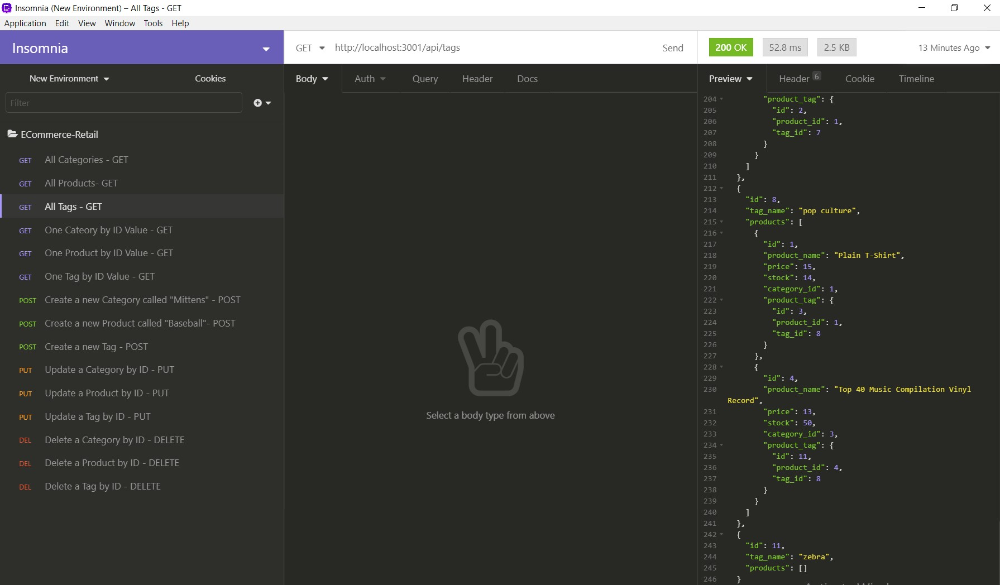

# E-Commerce Back-End
This exercise focuses on backend and middleware: Sequelize object relational mapping (ORM)models and MySQL2 to connect to Express.js API routes and MySQL database content.

## GitHub repository
https://github.com/ktrnthsnr/ecommerce-retail

## Table of Contents
* [Description](#description)
* [Installations](#installations)
* [Usage](#usage)
* [Technology](#technology)
* [Contribution](#contribution)

## Description
- Given a working Express.js API, the work for this e-commerce back-end project involves using MySQL2 and Sequelize models to interact with the MySQL database. 
- Once invoking the app, `npm start`, Node.js will start the Express.js server and Sequelize will sync its models with the MySQL database, and create and seed the tables.
- A walkthrough link under Usage below will demonstrate the API endpoints for each of the routes created. The Insomnia browser will render the JSON content based upon the Sequelize models, connecting to the backend tables via the API endpoints.

### The server-side work included:
  - updated js config to sync Sequelize models to the database, when Express server is instantiated
  - created API routes for various query selections to the Express server
  - filled out routes creating RESTful CRUD operations, included GET, POST, PUT, DELETE routes to create, select, update and delete rows on these tables: category, product, and tags
  - then tested the routes using the debugging Insomnia tool as http API endpoints, rendering the URLs to view the database results, and for entering new content into the database, added JSON test content for the POST, PUT, and DELETE endpoints
  - configured dotenv to store sensitive db connection data in environment variables
  - utilized Sequelize and mysql2 to connect the Express.js to the MySQL database
  - added a create database script
  - added the Sequelize model js scripts that build each table 
  - added foreign key relationships through Sequelize reference constructions

## Installations
- Prereq: install VSCode, Node.js `nodejs -v`, and MySQL http://dev.mysql.com/downloads/
- After cloning the GitHub repo to your local drive,run the following in the VSCode command-line terminal
- Intialize npm
- $ `npm init -y`
- Create a .gitignore file in the root and add node_modules to this file
- If you need to re-add the dependencies, run $ `npm install`
- Install Express, Sequelize and mysql2
- $ `npm install express sequelize mysql2`
- If you need to install separately:
    - Install Express.js
    - $ `npm install express --save` or $ `npm i express`
    - Install Sequelize, more info https://www.npmjs.com/package/sequelize
    - $ `npm install --save sequelize`
    - $ `npm install -g sequelize-cli`
    - (No need to iniatize as the configuration files are installed, $ `sequelize init`)
    - Install MySQL anad MSQL2, create a pwd, then afterwards verify installed, $ `mysql --version`
    - $ `npm install -g mysql`
    - $ `npm install mysql2 --save`
- Install console.table to print MySQL in console
- $ `npm install console.table --save`
- Install dotenv, more info https://www.npmjs.com/package/dotenv
- $ `npm install dotenv`
- Install a body-parser module to parse JSON payloads
- `npm install body-parser --save`
- Install Insomnia locally to test the GET, POST, PUT, and DELETE API endpoints per the routes.

## Usage
- Within the VSCode terminal, start MySQL
-   $ `mysql -u root -p`
- Enter your MySQL password when prompted

- Create the database 
-   mysql> `source db/schema.sql`
- Validate database was created
-   mysql> `show databases`

- Start using the db
-   mysql> `USE ecommerce_db;`

- Add content into the tables provided from /seeds/*.js files.
-   $ `npm run seed`
- Validate tables were created
-  mysql>`describe category;describe product;describe product_tag;describe tag;`
- Validate tables were populated
-  mysql>`select * from category;select * from product;select * from product_tag;select * from tag;`

- If you are ready to run the application locally, run the following. This will start the Express server, sync the Sequelize ORM models to the mysql database and if not seeded, will populate the tables' rows. It will not replace already seeded tables.
- Start the application:
-   $ `npm start` or $ `node server.js`

- Validate: View all rows within the Categories table, through a sample API endpoint. Open the Insomnia debug tool, enter a GET URL, `http://localhost:3001/api/categories`.  Other validation endpoints for all CRUD queries are listed in the routes files.

- A walkthrough of how the Node.js Sequelize application works, from creating the mysql database and tables, to seeding and testing the GET, POST, PULL, and DELETE API routes via the Insomnia testing tool, (ran out of time on the delete route)
https://drive.google.com/file/d/1IcyrSXyOH0As0uq-q9dNulYwxukrSoSX/view
- The last bit of the  Screencastify walkthrough, the delete route, is included here https://drive.google.com/file/d/1RoKgs35hDoAKzQlkdaZBOlB3tPnM0x14/view

- Insomnia GET route sample

## Technology
MySQL, MySQL2, Express.js, Sequelize, Node.js, JavaScript, npm, HTML, CSS, dotenv

## Contribution
ktrnthsnr

### ©️2020 ktrnthsnr
